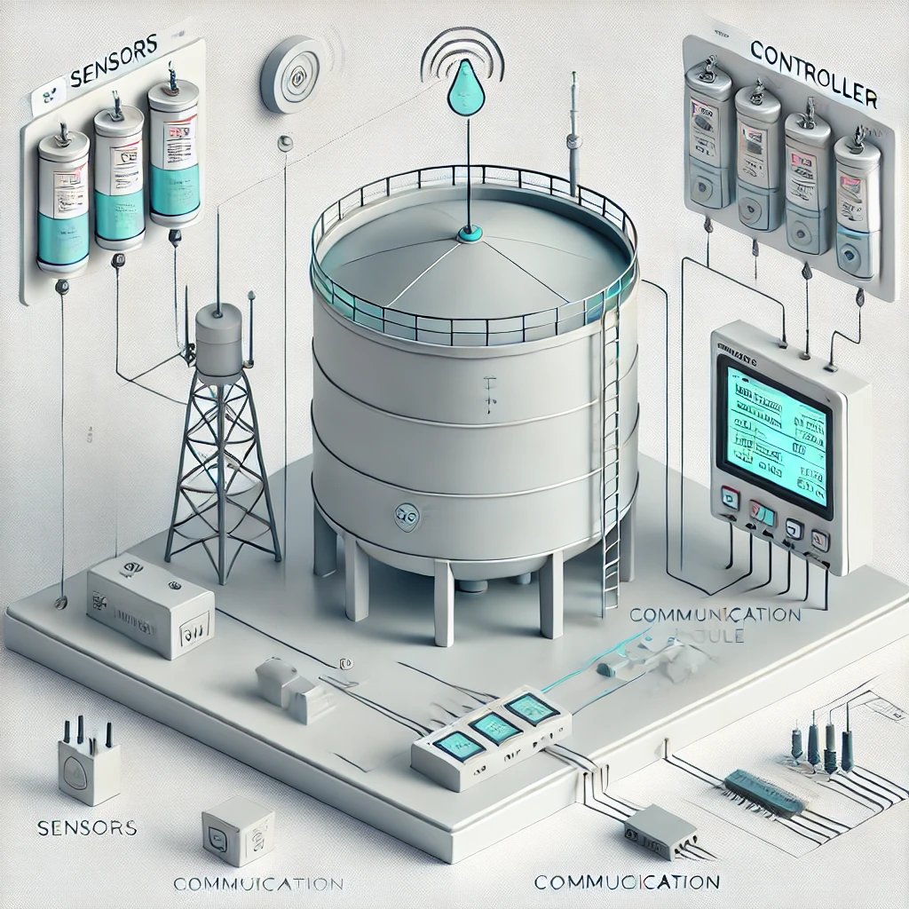

# LIQUID LEVEL MONITORING SYSTEM
A Liquid Level Monitoring System tracks and manages liquid levels in tanks using sensors, ensuring optimal levels and preventing overflow or shortages.


## Table of contents
[introduction](#introduction)


## Introduction
A liquid level monitoring system is an IoT-based project that allows
users to remotely monitor the liquid level in a container.
This system is beneficial in industries where liquids are stored in
large containers or tanks, such as chemical plants or oil refineries.
The system uses ultrasonic sensors to measure the liquid level and
transmit the data to a microcontroller.
The microcontroller processes the data and
sends it to a web server via the internet.
Users can then access the data from a web browser or
mobile app and receive real-time updates on the liquid level.

## Objectives
The benefits of a liquid-level monitoring system include
increased
efficiency,
cost-effectiveness,
and improved safety.
By monitoring the liquid level in a container, users can avoid
overfilling or underfilling, which can result in costly spills or
damage to equipment.
The system can also track liquid usage, enabling users to
optimize their processes and reduce waste. Additionally, the
system can provide early warning of leaks or other issues,
allowing for timely intervention and improved safety.

## Components
1. Ultrasonic sensors.  
2. A microcontroller.  
3. A Wi-Fi or Ethernet module.  
4. A web server or cloud platform.  

## Applications
some of the applications are:  
- Water Treatment Plants  
- Fuel Storage  
- Chemical Processing  
- Food and Beverage Industry  
- Agriculture  

## Team
[alaa atwa](https://github.com/Alaa-Atwa)  
[mazen khaled](https://github.com/Mabona3)  

##### NOTE:

```html
Installing Bootstrap command
>> npm install bootstrap@4.0.0-alpha.6 --save


1- Insert the following code in the <head> of index.html file before the title.
-------------------------------------------------------------------
<!-- Required meta tags always come first -->
<meta charset="utf-8">
<meta name="viewport" content="width=device-width, initial-scale=1, shrink-to-fit=no">
<meta http-equiv="x-ua-compatible" content="ie=edge">
<!-- Bootstrap CSS -->
<link rel="stylesheet" href="node_modules/bootstrap/dist/css/bootstrap.min.css">
-------------------------------------------------------------------


2- At the bottom of the page, just before the end of the body tag </body>, 
   add the following code to include the JQuery library, tether library and Bootstrap's JavaScript plugins. 
   Bootstrap by default uses the JQuery JavaScript library for its JavaScript plugins. 
   Hence the need to include JQuery library in the web page.
-------------------------------------------------------------------
<!-- jQuery first, then Tether, then Bootstrap JS. -->
<script src="node_modules/jquery/dist/jquery.min.js"></script>
<script src="node_modules/tether/dist/js/tether.min.js"></script>
<script src="node_modules/bootstrap/dist/js/bootstrap.min.js"></script>
-------------------------------------------------------------------
```
